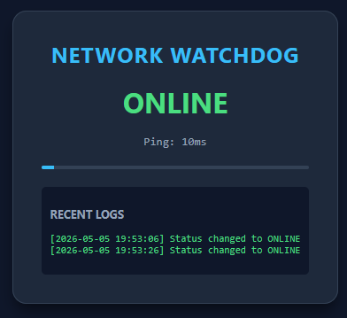

# ESP32 Network Watchdog & Dashboard

A professional-grade IoT monitoring solution that tracks network stability and serves a real-time web interface. This project demonstrates hardware-software integration, asynchronous networking, and persistent data management on embedded systems.

## Key Features
* **Real-Time Monitoring:** Performs background pings to verify internet connectivity without blocking the web server.
* **Asynchronous Web Engine:** Serves a modern dashboard to multiple clients using `ESPAsyncWebServer`.
* **Persistent Logging:** Utilizes the **LittleFS** filesystem to log status changes and outages directly to the ESP32's flash memory.
* **NTP Time Integration:** Syncs with Network Time Protocol servers to provide accurate timestamps for all system events.

## Tech Stack
* **Firmware:** C++ (Arduino Framework)
* **Hardware:** ESP32-WROOM
* **Storage:** LittleFS (Flash Memory Partitioning)
* **Frontend:** HTML5, CSS3 (Modern Dark Mode), JavaScript (ES6 Fetch API)

## Installation & Setup
1. Clone this repository.
2. Create a `secrets.h` file in the `include/` folder with your WiFi credentials.
3. Use the **PlatformIO: Build Filesystem Image** task to prepare the `data/` folder.
4. **Upload** the filesystem image and then the firmware to your ESP32.
